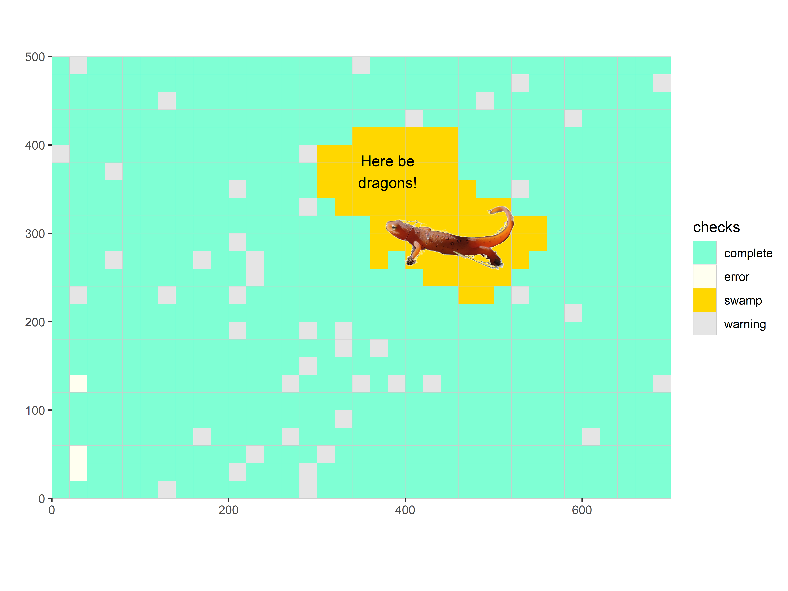
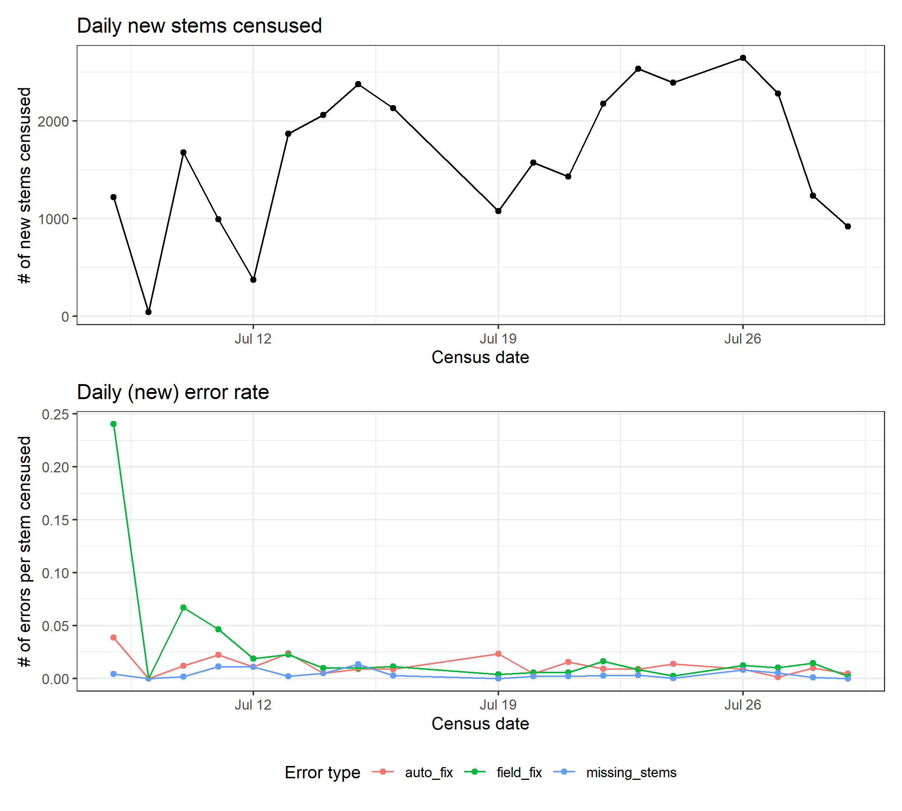
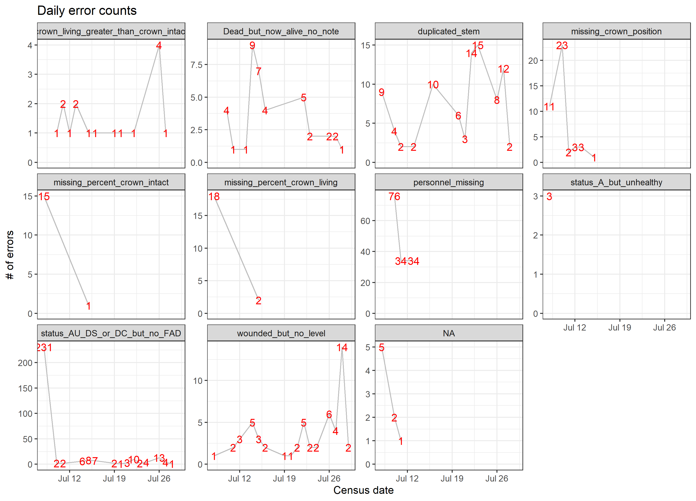

# Harvard Tree Mortality 

*This repo was copied from [SCBI-ForestGEO/SCBImortality](https://github.com/SCBI-ForestGEO/SCBImortality) and modified for use at Harvard Forest.*

## Current Census Dashboard

### data entry issues to resolve?

**[Click here to view error reports.](https://github.com/SCBI-ForestGEO/HarvardMortality/tree/main/testthat/reports/)**

### warnings? 
*These do not cause the tests to fail, but may indicate problems and should be reviewed.*

### mortality survey completion status

### map of census progress

 

### Daily progress report

### Daily field fix error counts

